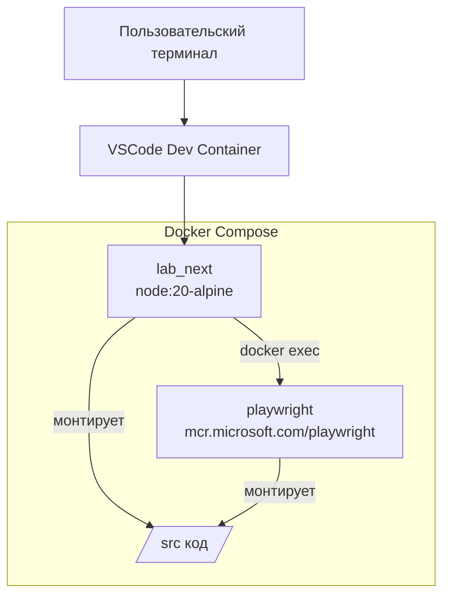

# Техническое задание: Настройка Docker-инфраструктуры для запуска Playwright тестов

## 1. Цель
Организовать изолированную среду разработки и тестирования для проекта `course_full_lab` с использованием Docker, обеспечивающую:
- Сборку основного приложения Next.js в контейнере `lab_next`.
- Запуск end-to-end тестов Playwright в отдельном контейнере `playwright` (для уменьшения веса основного контейнера).
- Подключение к контейнеру `lab_next` через VSCode Dev Containers.
- Возможность запуска Playwright тестов из терминала контейнера `lab_next` с отображением результатов в этом же терминале.
- Переносимость образов между компьютерами без необходимости доступа к интернету.

## 2. Текущее состояние проекта
- Проект использует Next.js 15, TypeScript, Drizzle ORM, Better Auth, tRPC.
- Тесты Playwright уже настроены (см. `playwright.config.ts` и скрипты `test:e2e*` в `package.json`).
- Docker-инфраструктура отсутствует.

## 3. Требования

### 3.1. Контейнеризация
- **Контейнер `lab_next`**:
  - Базовый образ: `node:20-alpine`.
  - Установлен Git (для работы с зависимостями, возможно, для клонирования).
  - Установлен Docker CLI (для выполнения `docker exec`).
  - Установлены **все зависимости проекта** (`npm ci`), включая devDependencies (кроме тех, которые специфичны для playwright).
  - Запуск unit-тестов Vitest будет производиться внутри этого контейнера.
  - Монтирование исходного кода проекта как volume (для разработки).
  - Доступ к Docker socket (для выполнения `docker exec` в контейнер `playwright`).
  - Экспозиция порта 3000 для Next.js приложения.

- **Контейнер `playwright`**:
  - Базовый образ: `mcr.microsoft.com/playwright:latest` (или версия, соответствующая проекту).
  - Установлены **только зависимости, необходимые для запуска Playwright тестов**:
    - `@playwright/test`
    - `playwright`
    - Остальные devDependencies (такие как TypeScript, ESLint, Prettier, TailwindCSS, Drizzle‑Kit, Vitest) **не устанавливаются**.
  - Монтирование исходного кода проекта как volume (только для чтения).
  - Не требует отдельного экспорта портов.

### 3.2. Оркестрация
- Использовать `docker-compose.yml` для определения двух сервисов.
- Сервисы должны находиться в одной пользовательской сети Docker.
- Контейнер `playwright` должен быть доступен по имени `playwright` из сети.

### 3.3. Запуск тестов
- Из терминала контейнера `lab_next` пользователь может выполнить команду `npm run test:e2e` (или специальную wrapper-команду).
- Команда должна:
  1. Убедиться, что контейнер `playwright` запущен.
  2. Выполнить внутри контейнера `playwright` команду `npx playwright test`.
  3. Передать все аргументы командной строки (например, `--headed`, `--ui`).
  4. Вывести stdout/stderr выполнения тестов в терминал `lab_next`.
  5. Завершиться с тем же кодом возврата, что и тесты.

### 3.4. Интеграция с VSCode Dev Containers
- Создать конфигурацию `.devcontainer/devcontainer.json`, которая:
  - Использует сервис `lab_next` как контейнер разработки.
  - Монтирует рабочую директорию проекта.
  - Устанавливает необходимые расширения VSCode:
    - `ms-vscode.vscode-typescript-next`
    - `ms-azuretools.vscode-docker`
    - `bradlc.vscode-tailwindcss`
    - `examenator.examenator` (расширение Examenator)
    - `dbaeumer.vscode-eslint`
    - `esbenp.prettier-vscode`
  - Настраивает forward порта 3000.
  - Предоставляет команду для запуска тестов (как задачу VSCode).

### 3.5. Производительность и ресурсы
- Минимизировать размер образов (использовать alpine-версии, многостадийные сборки где уместно).
- Избегать дублирования кода между контейнерами (общие volume).
- Обеспечить быструю пересборку при изменении исходного кода.

### 3.6. Переносимость
- Образы должны быть экспортируемы в файлы `.tar` с помощью `docker save`.
- Предоставить скрипты для сохранения образов (`save-images.sh`) и загрузки на другом компьютере (`load-images.sh`).
- При переносе образов должна сохраняться возможность запуска контейнеров без доступа к интернету.

## 4. Архитектура



## 5. Детали реализации

### 5.1. Файлы Docker
- `Dockerfile.lab_next` — сборка образа для основного приложения.
- `Dockerfile.playwright` — сборка образа для тестов.
- `docker-compose.yml` — оркестрация сервисов.
- `.devcontainer/devcontainer.json` — конфигурация Dev Container.

### 5.2. Скрипты
- В `package.json` добавить скрипт `test:e2e:docker`, который будет запускаться внутри `lab_next` и делегировать выполнение в контейнер `playwright`.
- Альтернативно: создать bash-скрипт `scripts/run-playwright.sh`, который использует `docker exec`.
- Скрипты для переноса образов: `scripts/save-images.sh`, `scripts/load-images.sh`.

### 5.3. Переменные окружения
- Для `lab_next` потребуются переменные из `.env` (DATABASE_URL, BETTER_AUTH_SECRET и т.д.).
- Для `playwright` могут потребоваться те же переменные, кроме секретов, если тесты обращаются к БД.

### 5.4. Сеть
- Создать сеть `lab_network` в docker-compose.
- Сервисы будут иметь имена `lab_next` и `playwright`, доступные по этим именам.

### 5.5. Volume
- Использовать named volume для `node_modules` в `lab_next`, чтобы избежать проблем с производительностью на macOS/Windows.
- Исходный код монтировать как bind mount (`.:/app`).

### 5.6. Сборка с использованием Docker BuildKit
- Включить BuildKit для оптимизации кэширования и многостадийных сборок.
- Использовать `--mount=type=cache` для ускорения установки зависимостей.

## 6. План работ

1. **Создание Dockerfile для lab_next**
   - Базовый образ node:20-alpine
   - Установка git, docker-cli
   - Копирование package.json и package-lock.json
   - Установка всех зависимостей (npm ci)
   - Копирование остального кода
   - Настройка рабочей директории /app
   - Команда по умолчанию: `npm run dev`

2. **Создание Dockerfile для playwright**
   - Базовый образ mcr.microsoft.com/playwright:latest
   - Установка только @playwright/test и playwright (через `npm install @playwright/test playwright`)
   - Копирование всего кода
   - Рабочая директория /app

3. **Создание docker-compose.yml**
   - Определение сервисов
   - Настройка volumes, network, ports
   - Зависимости: playwright зависит от lab_next? (нет, они независимы)

4. **Создание devcontainer.json**
   - Конфигурация для VSCode
   - Задачи и команды
   - Список расширений

5. **Создание скрипта запуска тестов**
   - Bash-скрипт, использующий `docker exec`
   - Интеграция с npm scripts

6. **Создание скриптов для переноса образов**
   - `save-images.sh` — сохраняет образы в tar-архивы
   - `load-images.sh` — загружает образы из tar-архивов

7. **Тестирование**
   - Проверка сборки образов
   - Запуск контейнеров
   - Проверка доступа к приложению на localhost:3000
   - Запуск тестов через wrapper-команду
   - Проверка переносимости (сохранение/загрузка образов)

8. **Документация**
   - README с инструкцией по использованию
   - Возможные проблемы и их решение

## 7. Риски и ограничения
- Доступ к Docker socket из контейнера представляет угрозу безопасности (в продакшене не использовать). Приемлемо для разработки.
- Размер образа playwright может быть большим (около 1.5 ГБ). Можно использовать образ с только необходимыми браузерами.
- Производительность файловой системы при монтировании кода на Windows/Mac может быть низкой. Рекомендуется использовать Docker Desktop с настроенными ресурсами.

## 8. Критерии приемки
- [ ] Контейнер `lab_next` успешно собирается и запускает Next.js приложение на порту 3000.
- [ ] Контейнер `playwright` успешно собирается и может выполнить `npx playwright test` внутри себя.
- [ ] Из терминала `lab_next` команда `npm run test:e2e:docker` запускает тесты в контейнере `playwright` и выводит результаты.
- [ ] VSCode может подключиться к контейнеру `lab_next` через Dev Containers, установлены все указанные расширения.
- [ ] Все существующие тесты Playwright проходят в новой среде.
- [ ] Образы могут быть сохранены в tar-архивы и загружены на другом компьютере без интернета, после чего контейнеры запускаются корректно.

## 9. Приложения

### 9.1. Пример docker-compose.yml (черновик)
```yaml
version: '3.8'

services:
  lab_next:
    build:
      context: .
      dockerfile: Dockerfile.lab_next
    ports:
      - "3000:3000"
    volumes:
      - .:/app
      - lab_next_node_modules:/app/node_modules
      - /var/run/docker.sock:/var/run/docker.sock
    environment:
      - NODE_ENV=development
      - DATABASE_URL=postgresql://...
    networks:
      - lab_network
    command: npm run dev

  playwright:
    build:
      context: .
      dockerfile: Dockerfile.playwright
    volumes:
      - .:/app:ro
      - playwright_node_modules:/app/node_modules
    networks:
      - lab_network
    command: tail -f /dev/null  # keep container running
```

### 9.2. Пример скрипта run-playwright.sh
```bash
#!/bin/sh
docker exec -it course_full_lab-playwright-1 npx playwright test "$@"
```

### 9.3. Пример скрипта save-images.sh
```bash
#!/bin/bash
docker save -o lab_next.tar course_full_lab-lab_next
docker save -o playwright.tar course_full_lab-playwright
```

### 9.4. Пример скрипта load-images.sh
```bash
#!/bin/bash
docker load -i lab_next.tar
docker load -i playwright.tar
```

---
*ТЗ подготовлено в рамках задачи по настройке схемы работы проекта. После утверждения будет выполнена реализация.*